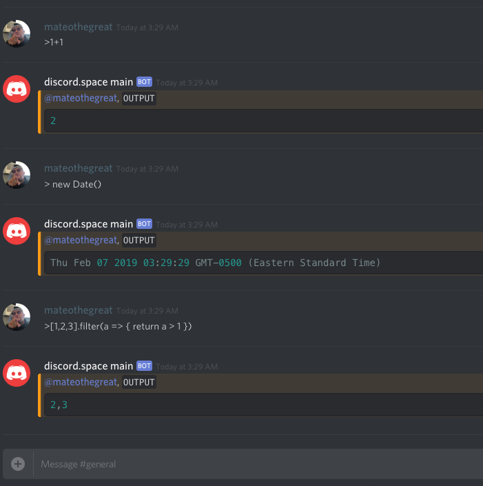

# Discord Bot that Executes and returns Javascript Code



## Getting Started
```bash
$ git clone https://github.com/mateothegreat/discord-bot-javascript-evaluator
$ cd discord-bot-javascript-evaluator
$ npm start

± |master S:1 U:2 ✗| → npm start

> discord-bot-javascript-evaluator@1.0.0 start /Users/yomateod/workspace/work/discord-bot-javascript-evaluator
> node bot.js

Thu Feb 07 2019 03:29:17 GMT-0500 (Eastern Standard Time) bot started!
Thu Feb 07 2019 03:29:23 GMT-0500 (Eastern Standard Time) mateothegreat: 1+1 = 2
Thu Feb 07 2019 03:29:29 GMT-0500 (Eastern Standard Time) mateothegreat:  new Date() = Thu Feb 07 2019 03:29:29 GMT-0500 (Eastern Standard Time)
Thu Feb 07 2019 03:29:37 GMT-0500 (Eastern Standard Time) mateothegreat: [1,2,3].filter(a => { return a > 1 }) = 2,3

```
